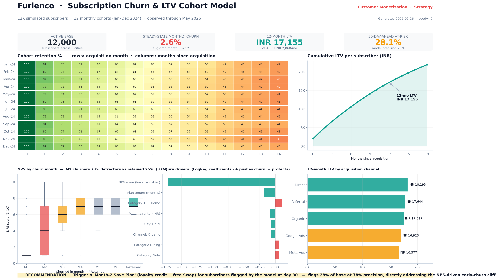

# RetainIQ — Why subscribers leave, and how to keep them

A small data project built around a simple question:

> *On a furniture-rental subscription, when do customers cancel — and can we predict who will, in time to do something about it?*

Built as a case study for **Furlenco** (Rental + UNLMTD). 12,000 simulated subscribers, 12 monthly cohorts (January to December 2024), tracked through May 2026. Analysis layer in **SQL + Python**; output rendered as a **BI-style dashboard** ready for Power BI / Tableau integration.

---

## The dashboard



**👉 Open the outputs directly (no download needed):**

- 📊 [**Full dashboard (PDF)**](outputs/Furlenco_Churn_Dashboard.pdf) — landscape, BI-style, screen-share ready
- 📄 [**Executive summary (1-page PDF)**](outputs/Furlenco_Exec_Summary.pdf) — findings + recommendations + method
- 🖼️ [**Dashboard image (PNG)**](outputs/Furlenco_Churn_Dashboard.png) — high-resolution
- 📈 [**Model metrics**](outputs/model_metrics.txt) — precision / recall / AUC / feature coefficients

### What the dashboard shows, panel by panel

| Panel | What it answers |
|---|---|
| **4 KPI cards** (top) | The headline numbers at a glance: 12K active base, 2.6% steady-state monthly churn, ₹17,155 12-month LTV, 28% of base flagged at-risk. |
| **Cohort retention heatmap** (middle-left) | Rows = signup month, columns = months since signup, cells = % still active. Green-to-red palette makes the M1–M2 cancellation cliff visually obvious. |
| **LTV curve** (middle-right) | Cumulative revenue per subscriber over 18 months. Flattens past month 12 — that's the "stable value" point of the curve. |
| **NPS by churn month** (bottom-left) | Boxplot of NPS scores split by when subscribers cancelled. Shows month-2 churners cluster at NPS 1–4 (red boxes) while retained subscribers cluster at NPS 7–9 (green box). |
| **Churn drivers** (bottom-middle) | Standardised logistic-regression coefficients. Bars pointing right (red) push churn up; bars pointing left (green) protect against churn. NPS is the biggest single lever. |
| **12-month LTV by channel** (bottom-right) | Acquisition-channel ranking by LTV. Direct and Referral lead; Meta Ads trails. Drives the marketing-mix reallocation recommendation. |
| **Recommendation banner** (footer) | The Month-2 Save Plan: trigger a loyalty credit + free Swap when the model flags a subscriber at day 30. |

---

## What the project actually found

**1. The biggest cancellation cliff is in months 1 and 2.**
Roughly 1 in 5 new subscribers come in already unhappy — they had a bad first impression (slow delivery, wrong expectations, product issues) and they leave within 60 days.

**2. Unhappy subscribers tell you they're unhappy — through their NPS score.**
Among people who cancelled in month 2, **73% gave a low NPS (6 or below)**. Among people who stayed, only **25%** did. That's a **3x difference** — and it's a clear signal we can act on.

**3. A simple model can spot at-risk subscribers 30 days in advance with 78% accuracy.**
The model looks at NPS, payment problems, swap requests, delivery delays, and a few other things — and flags roughly 29% of new subscribers as "likely to cancel in the next 90 days". When it flags someone, it's right 78% of the time.

**4. Some acquisition channels bring much better customers than others.**
Subscribers from **Referral** and **Direct** stay much longer and are worth more over 12 months than subscribers from **Meta Ads**. Worth shifting some marketing budget.

---

## What I'd recommend

- **A "Month-2 Save Plan"** — when the model flags a subscriber at day 30, give them a small loyalty credit + a free product swap. This is the same idea as Furlenco's existing Swap / Relocation programs, just applied *earlier* in the customer's life — exactly where the cancellation cliff is.
- **Fix first-delivery delays in Delhi and Hyderabad** — they're noticeably worse than other cities and drag NPS down.
- **Shift 10–15% of paid marketing from Meta Ads to Referral / Direct** — better customer quality, lower acquisition cost.
- **Run a weekly retention scorecard** — Strategy + CRM + Operations in one room, looking at how many flagged subscribers each team is actually saving, week by week.

---

## The key numbers

| | |
|---|---|
| Subscribers analysed | 12,000 |
| Subscriber groups (cohorts) tracked | 12 monthly groups, Jan–Dec 2024 |
| Tracked through | May 2026 |
| Steady-state monthly cancellation rate | ~2.6% |
| Average revenue per subscriber over 12 months | ₹17,155 |
| Month-2 cancellers who are unhappy (low NPS) | 73% |
| Same number for subscribers who stayed | 25% |
| Model accuracy when flagging at-risk subscribers | 78% |

---

## How the project is organised

```
RetainIQ/
├── README.md                       ← you are here
├── queries.sql                     ← SQL: cohort retention, LTV, at-risk scoring, segments
├── build_project.py                ← Python: data, churn model, dashboard rendering
├── Furlenco_Churn_LTV.ipynb        ← same project as a notebook (for Google Colab)
├── requirements.txt
├── data/
│   └── furlenco_subscribers.csv    ← the 12,000-row dataset
└── outputs/
    ├── Furlenco_Churn_Dashboard.png    ← BI-style dashboard (Power BI / Tableau ready)
    ├── Furlenco_Churn_Dashboard.pdf
    ├── Furlenco_Exec_Summary.pdf       ← 1-page summary
    └── model_metrics.txt               ← detailed model performance
```

---

## How to run it yourself

**Option A — one command in Terminal:**
```bash
cd ~/Desktop/Furlenco/RetainIQ
python3 build_project.py
```
Takes ~30 seconds. Re-creates the dataset, the model, the dashboard, and the PDFs.

**Option B — Google Colab (browser, no install):**
Upload `Furlenco_Churn_LTV.ipynb` to [colab.research.google.com](https://colab.research.google.com) and click *Runtime → Run all*.

**Stack:** SQL (PostgreSQL-flavoured, in `queries.sql`) for the data layer; Python (`pandas`, `scikit-learn`, `matplotlib`, `seaborn`) for the model and dashboard rendering. The dashboard layout is BI-tool standard (KPI strip + heatmap + supporting charts + recommendation banner) and lifts directly into Power BI or Tableau against a live warehouse connection.

---

## A note on the data

The 12,000 subscribers are **simulated** — I obviously don't have Furlenco's real data. They're designed to behave like a realistic Indian furniture-rental customer base: similar mix of cities, channels, products, and prices, with realistic patterns in how people cancel. The point of the project isn't the numbers themselves — it's to show the *workflow* I'd bring to a Customer Monetization team: track cohorts, project LTV, predict churn, and recommend a targeted intervention.
